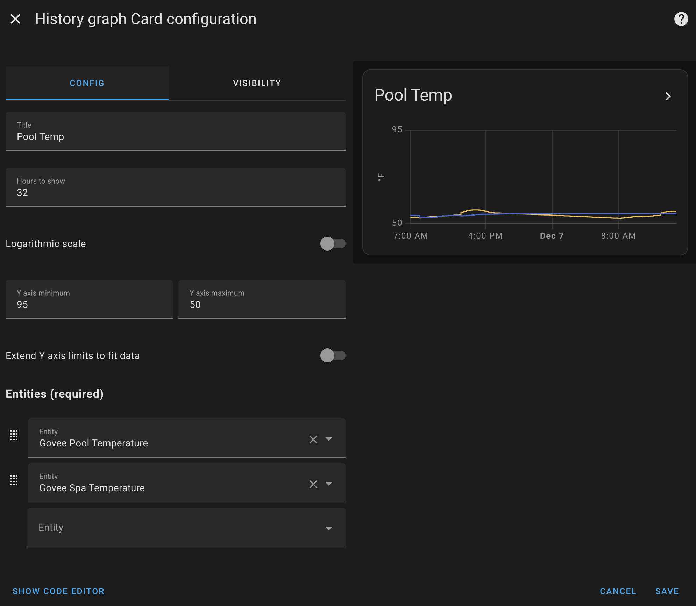

# Govee H5042 Pool Thermometer Logger

Having purchased a GoveeLife Smart Pool Thermometer with Smart Gateway, I was dismayed to find out integrating the sensor
values with Home Assistant wouldn't work out of the box. After discoveing it wasn't possible using the Govee API, I decided 
to see if there was a quick and hacky way to retrieve the sensor values. 

To make a long story short, I discovered it was trivial to reply the network request that the mobile Govee app makes and parse
the temperature values out of the response JSON. Here's how to do it.

I have only tested this on iOS, but if Proxyman (or something equivalent) exists on Android, that should work, too.

## Overview
This repo helps you set up a service which makes an API request to Govee to retrieve your sensor values and expose them over HTTP
to home assistant.

## Required Components
* Govee Pool Thermometer & H5042 gateway
* Govee App
* Proxyman App
* A linux-based system that your home assistant host can reach over the network
* jq, curl

## Step by Step Instructions
1. Download [Proxyman](https://proxyman.io/ios) onto your iOS device
2. Configure Proxyman to be able to intercept HTTPS connections for the following domain (More -> SSL Proxying List):
    * app2.govee.com
3. Install the Proxyman profile and certificate according to the applications instructions
4. While the VPN is running and active, open your govee app and check the temperature of your pool sensor(s)
5. Go back to Proxyman and look at the items in "Home" and find "app2.govee.com"
6. Scroll until you find a request to https://app2.govee.com/device/rest/devices/v1/list
7. Click on that entry, then click on the gear in the upper right hand side > Copy as cURL
8. You'll need to send that string to the system that is going to be hosting the data for your home assistant. In my case, I'm running this on a RaspberryPi.
9. `git clone` this repo on whichever host will be running this service on your network in the `/opt` directory (or else modify the paths in `get_temps.sh`).
10. Modify `get_temps.sh` and paste the cURL value you copied in step 7 to replace the existing curl command there. Additionally, replace the "timestamp" header line with the following content: `-H 'timestamp: '"$TIMESTAMP" \`. I'm not sure if this header gets checked server-side or not.
11. Optional: Copy govee_h5042_sensor.service to `/etc/systemd/system/`, run `systemctl daemon-reload` and if you'd like it to run at startup, `systemctl enable govee_h5042_sensor`
12. To start the service, `service govee_h5042_sensor start`
13. At this point, you should be able to access http://<ip_address_of_host_running_govee_h5042_sensor>:9000/spa and http://<ip_address_of_host_running_govee_h5042_sensor>:9000/pool and see values being returned. If you do not, do not continue - the sensor will not work.
14. On your home assistant, add the following code to configuration.yaml and restart home assistant:
```
sensor:
  - platform: rest
    name: "Govee Pool Temperature"
    resource: "http://<ip_address_of_host_running_govee_h5042_sensor>:9000/<device_1_name>"
    scan_interval: 60
    unit_of_measurement: "°F"
  - platform: rest
    name: "Govee Spa Temperature"
    resource: "http://<ip_address_of_host_running_govee_h5042_sensor>:9000/<device_2_name>"
    scan_interval: 60
    unit_of_measurement: "°F"
```

Home Assistant should now start collecting historical data for this sensor, which allows you to create a graph:
